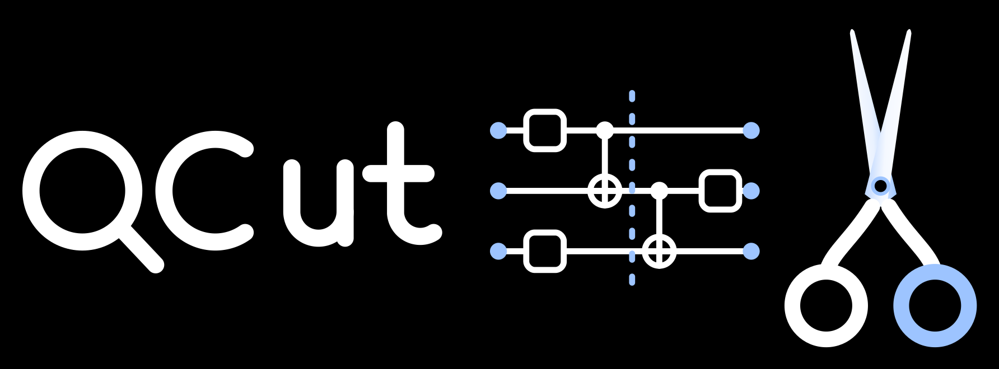

[](https://github.com/JooNiv/QCut/releases)
[](https://coveralls.io/github/JooNiv/QCut?branch=main)

[](https://opensource.org/licenses/Apache-2.0)


- [QCut](#qcut)
- [Installation](#installation)
- [Usage](#usage)
  - [Creating cut circuits and experiments](#creating-cut-circuits-and-experiments)
    - [What a cut costs](#what-a-cut-costs)
    - [Cheaper decompositions](#cheaper-decompositions)
    - [Options](#options)
    - [Automatic cuts](#automatic-cuts)
  - [Transpilation](#transpilation)
  - [Execution](#execution)
    - [Shorthand](#shorthand)
    - [Probability distributions](#probability-distributions)
    - [Running on FiQCI](#running-on-fiqci)
    - [Running on other hardware](#running-on-other-hardware)
  - [Logging](#logging)
- [Benchmarks](#benchmarks)
- [Documentation](#documentation)
- [Acknowledgements](#acknowledgements)
- [License](#license)


# QCut



QCut is a quantum circuit knitting package built on top of qiskit for performing gate cuts and resetless wire cuts allowing simulation of larger quantum circuits on smaller quantum devices or simulators at the cost of a circuit overhead. QCut has been designed and tested to work with IQM's qpus, and the Finnish Quantum Computing Infrastructure ([FiQCI](https://fiqci.fi/)).

QCut has been built at CSC - IT Center for Science (Finnish IT Center for Science).

Check out [docs](https://jooniv.github.io/QCut/) for instructions and more examples.

# Installation

For installation a UNIX-like system is currently needed due to [PyMetis](https://github.com/inducer/pymetis) being used for automatic cut finding. On Windows use WSL

**Pip:**  
Installation should be done via [`uv`](https://docs.astral.sh/uv/)

```bash
uv pip install QCut
#or
uv add QCut
```

If using other than the default Qiskit version (newest) it is recommended to install Qiskit first before installing QCut.

**IQM hardware and fake backends:**

```bash
uv pip install "QCut[iqm]"
#or
uv add "QCut[iqm]"
```

This pulls in IQM's Qiskit adapter ([iqm-client](https://docs.iqm.tech/iqm-client/)), which supports Qiskit 1.0 up to but not including
2.2, so installing it will hold Qiskit below 2.2. Install it into an environment whose
Qiskit is already in that range if you would rather the resolver did not move it.

After installing you can simply import what you need:

```python
from iqm.qiskit_iqm import IQMFakeAdonis
backend = IQMFakeAdonis()
```

Uv can be installed with

```bash
#Linux / mac
curl -LsSf https://astral.sh/uv/install.sh | sh
```

Note: for drawing circuits you might have to install pylatexenc. This can also be done with uv.

```bash
uv pip install pylatexenc
#or
uv add pylatexenc
```

**Install from source**  
It is also possible to use QCut by cloning this repository and including it in your project folder.

```bash
cd QCut
uv pip install .
#or
uv sync --no-dev

#or with dev deps
uv sync
```

# Usage

## Creating cut circuits and experiments

**1: Import needed packages**

```python
import numpy as np
import QCut as ck
from QCut import cut, cutGate, CutOptions, find_cuts
from qiskit import QuantumCircuit, transpile
from qiskit.circuit.library import CXGate
from qiskit.quantum_info import SparsePauliOp
from qiskit_aer import AerSimulator
from qiskit.primitives import StatevectorEstimator as Estimator, BackendEstimatorV2 as BackendEstimator
from iqm.qiskit_iqm import IQMFakeAdonis
```

**2: Start by defining a QuantumCircuit just like in Qiskit**

```python
circuit = QuantumCircuit(5)

for qubit in range(5):
    circuit.ry(0.4 + 0.3*qubit, qubit)
circuit.cx(0,1)
circuit.cx(1,2)
circuit.cx(2,3)
circuit.cx(3,4)

circuit.draw("mpl")
```


**3: Insert cut operations to the circuit to denote where we want to cut the circuit**

Note that here we don't insert any measurements. Measurements will be automatically handled by QCut.

```python
marked_circuit = QuantumCircuit(5)

for qubit in range(5):
    marked_circuit.ry(0.4 + 0.3*qubit, qubit)
marked_circuit.cx(0,1)
marked_circuit.append(**cutGate(CXGate(), 1, 2))
marked_circuit.cx(2,3)
marked_circuit.append(cut(), [3])
marked_circuit.cx(3,4)

marked_circuit.decompose(gates_to_decompose=["CutGate"]).draw("mpl")
```

`cutGate()` marks a gate cut and `cut()` a wire cut. Any two-qubit gate can be cut, with
the decomposition derived from the gate's KAK coordinates, so the CX above is a single
cut. See [gate cuts](https://jooniv.github.io/QCut/examples/GateCuts.html) and
[wire cuts](https://jooniv.github.io/QCut/examples/WireCuts.html) for more on placing
them, and [Theory](https://jooniv.github.io/QCut/Theory.html) for where the
decompositions come from.


**4: Extract cut locations from the marked circuit and split it into independent subcircuits.**

```python
cut_circuit = ck.get_locations_and_subcircuits(marked_circuit)
```

Now we can draw our subcircuits.

```python
cut_circuit.subcircuits[0].draw("mpl")
```


```python
cut_circuit.subcircuits[1].draw("mpl")
```


```python
cut_circuit.subcircuits[2].draw("mpl")
```


**5: Generate experiment circuits**

```python
observables = SparsePauliOp(["IIIIZ", "IIIZI", "IIZII", "IIIZZ"])

cut_experiment = ck.get_experiment_circuits(cut_circuit, observables)

print(cut_experiment.num_groups)
```

`48`

`get_experiment_circuits()` does not modify the `CutCircuit` it is given, so the same
split can be reused for several observable sets. Both `CutCircuit` and `CutExperiment`
implement the `assign_parameters()` function of `Qiskit.QuantumCircuit`.

### What a cut costs

```python
print(cut_circuit.gamma, cut_circuit.optimal_gamma)
```

`12.0 9.0`

`gamma` is the sampling overhead of this split and `optimal_gamma` the least those same
cuts could cost with every decomposition available. Shot cost goes as `gamma` squared.
Both are closed form, so a plan can be costed before any experiment circuits are built,
and `CutExperiment` carries both forward.

The gap here is the lone wire cut: on its own it does not communicate under the default
`wire_cut_communication="auto"`, so it costs 4 rather than 3. Passing `"always"` closes
it and this split reaches 9.

### Cheaper decompositions

Cuts are not decomposed one at a time where a cheaper joint decomposition exists. All
three of the below are on by default and can be turned off through
[`CutOptions`](https://jooniv.github.io/QCut/Options.html).

| | default | turned off |
| --- | --- | --- |
| A run of gates on one qubit pair costs a single cut | 1 cut, γ 1.59, 6 subexperiments | 2 cuts, γ 9, 36 |
| Parallel single-axis rotations share one decomposition ([derivation](https://jooniv.github.io/QCut/theory/Joint_rotation_derivation.html)) | γ 5.50, 30 subexperiments | γ 6.77, 36 |
| A block of parallel wire cuts exchanges its measured outcome ([derivation](https://jooniv.github.io/QCut/theory/LOCC_wire_derivation.html)) | γ 7, 28 subexperiments | γ 16, 64 |

A separate circuit, to show the last of those on its own. Two parallel wire cuts cost
`2**(n+1) - 1` rather than `4**n`:

```python
pair = QuantumCircuit(4)
for qubit in range(4):
    pair.ry(0.4 + 0.2 * qubit, qubit)
pair.cx(0, 1)
pair.cx(0, 2)
pair.append(cut(), [1])
pair.append(cut(), [2])
pair.cx(1, 2)
pair.cx(2, 3)

block = ck.get_locations_and_subcircuits(pair)
local = ck.get_locations_and_subcircuits(
    pair, options=CutOptions(wire_cut_communication="never")
)

print(block.gamma, local.gamma, local.optimal_gamma)
```

`7.0 16.0 7.0`

Those cuts run in waves, since one side has to be measured before the other can prepare
what it measured. `run_experiments()` handles that itself.

### Options

`CutOptions` is collected once and carried through the run. It covers the three
decompositions above, the expansion strategy, sampling and the cut finder. Above 1000
groups the experiment is sampled from the quasiprobability distribution rather than
enumerated. Every option and its default is listed under
[Options](https://jooniv.github.io/QCut/Options.html).

### Automatic cuts

QCut comes with functionality for automatically finding good cut locations that can place both wire and gate cuts.

```python
options = CutOptions(
    finder_num_partitions=3,
    finder_cut_mode="both",
)

found = find_cuts(circuit, options=options)

print(len(found.cut_locations), found.gamma)
```

`2 9.0`

Here the finder reaches the `optimal_gamma` the hand-placed cuts above did not. See
[automatic cuts](https://jooniv.github.io/QCut/examples/AutomaticCuts.html) for the
finder's own options and how it chooses.

## Transpilation

Two helpers, `transpile_subcircuits()` and `transpile_experiments()` , differing in when they run:

```python
fake = IQMFakeAdonis() #noisy
sim = AerSimulator() #ideal
```

`transpile_circuits()` does whichever of the two the thing it is given calls for. Each
subcircuit once, before the experiment circuits are built:

```python
transpiled = ck.transpile_circuits(cut_circuit, fake, optimization_level=3)
cut_experiment = ck.get_experiment_circuits(transpiled, observables)
```

Or every experiment circuit, afterwards:

```python
cut_experiment = ck.transpile_circuits(
    ck.get_experiment_circuits(cut_circuit, observables), fake, optimization_level=3
)
```

Given a cut circuit it is much the faster of the two, but the subcircuits still carry the
cut and observable placeholders, so the transpiler is working on a circuit it cannot see
all of. On IQM backends It therefore disallows `remove_final_rzs` and `optimize_single_qubits` and raises. Given an experiment there are no
placeholders left , so it optimises further.

On an IQM backend both use IQM's own transpiler. Pass `use_iqm_transpiler=False` for the
ordinary Qiskit path. On a resonator device such as `IQMFakeDeneb` the MOVE gates are
routed in for you. See
[Basic usage](https://jooniv.github.io/QCut/Usage.html) for running against IQM fake backends and real hardware.

## Execution

```python
results = ck.run_experiments(cut_experiment, backend=fake)
expectation_values = ck.estimate_expectation_values(results)
```

The cost of an experiment run can be checked before submission:

```python
print(ck.estimate_run(cut_experiment, shots=4096, max_batch_size=40))
```

`Experiment will run 144 circuits in 4 jobs with a total of 589824 shots. See the returned object for the breakdown.`

```python
{'job1': JobEstimate(circuits=40, shots=4096), 'job2': JobEstimate(circuits=40, shots=4096), ...}
```

Exact for non-cummunicating runs. Runs whose wire cuts communicate get executed in waves so that
each wave after the first spends its shots on what the one before it measured. For these jobs
the circuit count is exact and job and shot counts are estimates.

`backend` takes a Qiskit backend, a V2 sampler, or anything else shaped like a backend,
which is what lets e.g. [fiqci-ems](https://github.com/FiQCI/fiqci-ems) run the experiment:

```python
from fiqci.ems import FiQCISampler

results = ck.run_experiments(
    cut_experiment, backend=FiQCISampler(backend, mitigation_level=1)
)
```

Every batch is submitted before any of it is collected, so a run queues all its jobs at
once. `max_batch_size` bounds how many circuits go in one, and a target that batches on
its own account is given that same size so it does not split a batch again.
`run_options` is passed on to every `run` call for anything else the target takes.

Note that `qiskit.primitives.StatevectorSampler` cannot be used since circruits from QCut contain
mid-circuit measurements and that sampler refuses those. `qiskit_aer.primitives.SamplerV2`
and `BackendSamplerV2` are both fine.

Comparing against the exact and noisy expectation values of the original circuit:

```python
obs = [ob.to_label() for ob in observables.paulis]

estimator = Estimator()
exact_expvals = [e.data.evs for e in
    estimator.run([(x) for x in zip([circuit] * len(obs), obs)]).result()
]

tr = transpile(circuit, backend=fake)

tr_obs = observables.apply_layout(tr.layout)

tr_obs_separate = [
    SparsePauliOp(pauli.to_label()) for pauli in tr_obs.paulis
]

fake_estimator = BackendEstimator(backend=fake)
exps = [e.data.evs for e in
    fake_estimator.run([(x) for x in zip([tr] * len(tr_obs_separate), tr_obs_separate)]).result()
]
```

```python
np.set_printoptions(formatter={"float": lambda x: f"{x:0.6f}"})

print(f"QCut expectation values:{np.array(expectation_values)}")
print(f"Noisy expectation values with fake backend:{np.array(exps)}")
print(f"Exact expectation values with ideal simulator :{np.array(exact_expvals)}")
```

`QCut expectation values:[0.763209 0.602396 0.328544 0.575471]`

`Noisy expectation values with fake backend:[0.846680 0.564941 0.323242 0.593262]`

`Exact expectation values with ideal simulator :[0.921061 0.704466 0.380625 0.764842]`

As we can see QCut is able to accurately reconstruct the expectation values and be more accurate that just using the fake backend as is. (Note that since this is a probabilistic method the results vary a bit each run)

Additionally we can execute QCut using the ideal Aer simulator and see that we get (practically) exact results:

`QCut expectation values:[0.920158 0.706660 0.379018 0.778012]`

### Shorthand

It is not necessary to go through each of the aforementioned steps individually. `run()`
takes a circuit with cuts marked in it and executes the whole sequence, and
`run_cut_circuit()` does the same for one that has already been split.

```python
print(ck.run(marked_circuit, observables, sim, shots=2**12))

print(ck.run_cut_circuit(found, observables, sim))
```

`[0.926887 0.699149 0.372935 0.765253]`

`[0.932540 0.717683 0.386038 0.775063]`

### Probability distributions

A cut experiment estimates expectation values, so there are no counts to tally, but the
distribution over a chosen set of qubits can still be recovered from them. Pass `qubits`
instead of `observables`:

```python
cut_experiment = ck.get_experiment_circuits(cut_circuit, qubits=[0, 1])
results = ck.run_experiments(cut_experiment, shots=4096, backend=sim)

probs = ck.estimate_probabilities(results)
```

`{'00': 0.8658, '01': -0.0024, '10': 0.1041, '11': 0.0324}`

`run()` and `run_cut_circuit()` take `qubits` in the same way, and hand back the
distribution rather than expectation values.

The whole distribution needs one measurement setting, so the experiment is the size it
would have been for a single observable however many qubits are asked for. See
[the derivation](https://jooniv.github.io/QCut/theory/Probability_reconstruction.html)
for how the distribution is reconstructed.

The result is a mapping, so it indexes and plots like a dict, and carries three views:

```python
probs['00']                     # 0.8658
probs.quasi_probabilities()     # the same values, as a plain dict
probs.nearest_probabilities()   # closest true distribution, negatives projected away
probs.counts()                  # scaled by the shots the experiment ran at
probs.counts(shots=1000)        # or by any other shots
```

The three dict views report, by default, the ten most likely bitstrings. Pass `top` for a different
number, or `top=None` for all of them:

```python
probs.quasi_probabilities(top=50)      # the fifty most likely
probs.counts(shots=1000, top=None)     # the whole distribution, as before
```

Note that :code:`counts()` sums to :code:`shots` only with :code:`top=None` and
Only :code:`quasi_probabilities()` gets cheaper this way since the other two project onto the
nearest physical distribution first.

Against the same circuit run whole:

```python
from qiskit.result import marginal_counts
from qiskit.visualization import plot_histogram

measured = circuit.measure_all(inplace=False)
counts = sim.run(transpile(measured, sim), shots=4096).result().get_counts()

plot_histogram(
    [probs.counts(), marginal_counts(counts, [0, 1])], legend=["QCut", "uncut circuit"]
)
```


### Running on FiQCI

For running on real hardware using the Lumi supercomputer follow the instructions [here](https://docs.csc.fi/computing/quantum-computing/running-quantum-jobs/). If you are used to using Qiskit on jupyter notebooks it is recommended to use the [Lumi web interface](https://docs.lumi-supercomputer.eu/runjobs/webui/).

### Running on other hardware

Running on other providers such as IBM is untested at the moment but as long as the hardware can be accessed with Qiskit QCut should be compatible.

## Logging

QCut reports what it decided at `INFO`, so nothing prints until logging is configured:

```python
import logging

logging.basicConfig(
    level=logging.INFO,
    format="%(asctime)s - %(name)s - %(levelname)s - %(message)s",
)

logging.getLogger("QCut").setLevel(logging.INFO)
logging.getLogger("qiskit").setLevel(logging.WARNING)
```

That covers the whole run: which partitions the finder costed and which it kept, whether
consolidation was worth it, which cuts were bundled and the gamma that bought, any bundle
the device could not take and what it fell back to, how many circuits went into each job
and that job's id, and how a communicating run split its shots between waves.

The job ids are the most important part. A job that fails or stalls on the device can be looked up by its id from the log.

# Benchmarks

[`benchmarks/QCutVsAddon.ipynb`](./benchmarks/QCutVsAddon.ipynb) briefly compares QCut against IBM's [qiskit-addon-cutting](https://github.com/Qiskit/qiskit-addon-cutting) given the same cuts: the gamma each achieves, how many subexperiments that comes to, how long they take to generate, and what the two cut finders settle on under the same qubit budget. The benchmarks show QCut consistently matching or beating the Qiskit Cutting Addon.

```bash
uv sync --group benchmark
```

Where one of QCut's joint decompositions applies, the same cuts cost less:

| | QCut | addon |
| --- | --- | --- |
| three wires cut at the same point | γ 15, 240 subexperiments | γ 64, 1024 |
| three rotations crossing one split | γ 7.16, 264 subexperiments | γ 10.5, 432 |
| an `rzz` and an `rxx` on each of three crossing pairs | γ 115 | γ 203 |

Where none applies, the QAOA layer at the sizes measured, the two agree exactly.
Turning consolidation, joint rotation cutting and
communicating wire cuts off reproduces the addon's gamma in every case the notebook
measures, which is what says the difference is those three and not something else. The
notebook also lists what each library has that the other does not.

# Documentation

Check out [jooniv.github.io/QCut/](https://jooniv.github.io/QCut/) for documentation and more examples.

The docs are built with sphinx using the sphinx book theme. To build the docs:

```bash
uv sync --group docs
cd docs
uv run sphinx-build -v -b html . build/sphinx/html -W
```

HTML files can then be found under `build/sphinx/html/`

# Acknowledgements

This project is built on top of [Qiskit](https://github.com/Qiskit/qiskit) which is licensed under the Apache 2.0 license.

# License

[Apache 2.0 license](https://github.com/JooNiv/QCut/blob/main/LICENSE)
