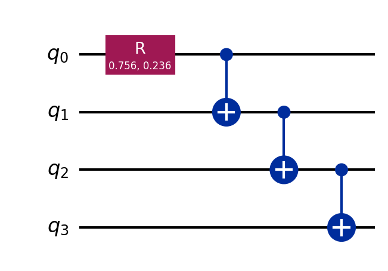
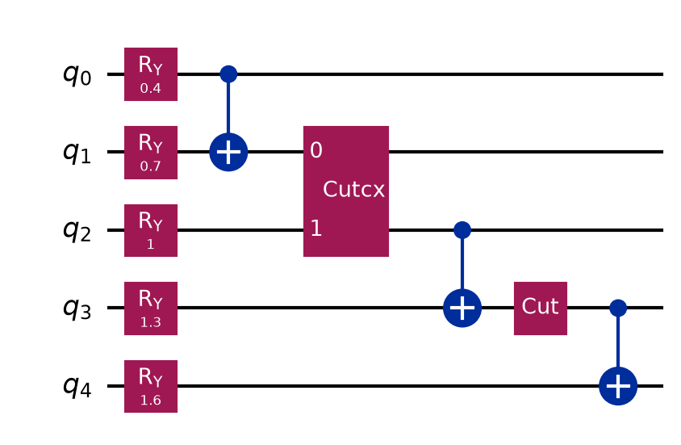
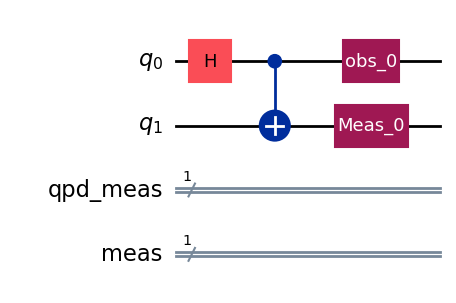
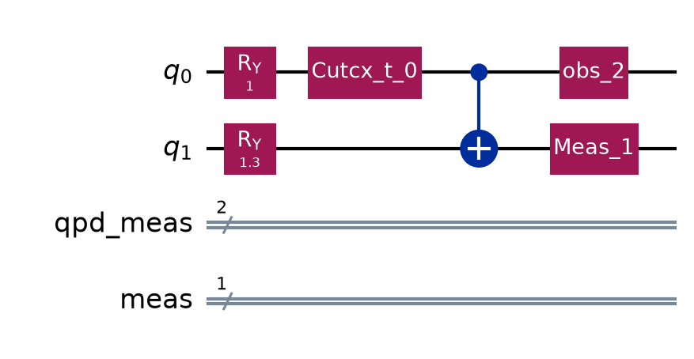
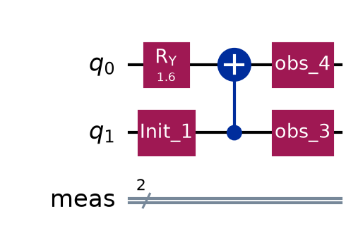
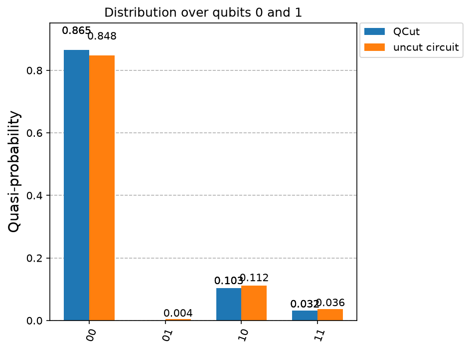

Basic Usage
===========

QCut is a quantum circuit knitting package capable of efficiently partitioning
quantum circuits with wire and gate cuts using advanced LOCC and joint rotation decompositions
along with the standard local decompositions. It is designed to be compatible with Qiskit and should
be compatible with any Qiskit programmable backend but has been especially designed to be compatible
with IQM’s qpus and the Finnish Quantum Computing Infrastructure (`FiQCI <https://fiqci.fi/>`__).

QCut has been built at CSC - IT Center for Science (Finnish IT Center for Science)

Creating cut circuits and experiments
-------------------------------------

Import needed packages
~~~~~~~~~~~~~~~~~~~~~~

.. code:: python

   import numpy as np
   import QCut as ck
   from QCut import cut, cutGate, CutOptions, find_cuts
   from qiskit import QuantumCircuit, transpile
   from qiskit.circuit.library import CXGate
   from qiskit.quantum_info import SparsePauliOp
   from qiskit_aer import AerSimulator
   from qiskit.primitives import StatevectorEstimator as Estimator, BackendEstimatorV2 as BackendEstimator
   from iqm.qiskit_iqm import IQMFakeAdonis

Define a QuantumCircuit just like in Qiskit
~~~~~~~~~~~~~~~~~~~~~~~~~~~~~~~~~~~~~~~~~~~

.. code:: python

   circuit = QuantumCircuit(5)

   for qubit in range(5):
       circuit.ry(0.4 + 0.3*qubit, qubit)
   circuit.cx(0,1)
   circuit.cx(1,2)
   circuit.cx(2,3)
   circuit.cx(3,4)

   circuit.draw("mpl")

Insert cuts to denote where to cut the circuit
~~~~~~~~~~~~~~~~~~~~~~~~~~~~~~~~~~~~~~~~~~~~~~

Note that here we don’t insert any measurements. Measurements will be
automatically handled by QCut.

.. code:: python

   marked_circuit = QuantumCircuit(5)

   for qubit in range(5):
       marked_circuit.ry(0.4 + 0.3*qubit, qubit)
   marked_circuit.cx(0,1)
   marked_circuit.append(**cutGate(CXGate(), 1, 2))
   marked_circuit.cx(2,3)
   marked_circuit.append(cut(), [3])
   marked_circuit.cx(3,4)

   marked_circuit.decompose(gates_to_decompose=["CutGate"]).draw("mpl")

:code:`cutGate()` marks a gate cut and :code:`cut()` a wire cut. Any two-qubit gate can
be cut, with the decomposition derived from the gate's KAK coordinates, so the CX above
is a single cut rather than a CZ with fix-up gates around it. See
:doc:`gate cuts <examples/GateCuts>` and :doc:`wire cuts <examples/WireCuts>` for more on
placing them, and :doc:`Theory` for where the decompositions come from.

Extract cut locations and split into independent subcircuits
~~~~~~~~~~~~~~~~~~~~~~~~~~~~~~~~~~~~~~~~~~~~~~~~~~~~~~~~~~~~

.. code:: python

   cut_circuit = ck.get_locations_and_subcircuits(marked_circuit)

Now we can draw our subcircuits.

.. code:: python

   cut_circuit.subcircuits[0].draw("mpl")

.. code:: python

   cut_circuit.subcircuits[1].draw("mpl")

.. code:: python

   cut_circuit.subcircuits[2].draw("mpl")

Define observables and generate experiment circuits
~~~~~~~~~~~~~~~~~~~~~~~~~~~~~~~~~~~~~~~~~~~~~~~~~~~

Observables are given the way Qiskit's estimator takes them: a Pauli label, a
:code:`Pauli`, a :code:`SparsePauliOp`, a :code:`SparseObservable`, a
:code:`{label: coefficient}` mapping, or any nested sequence of those. The expectation
values come back shaped like what you pass, so a list of four observables gives four
values, in order.

.. code:: python

   observables = ["IIIIZ", "IIIZI", "IIZII", "IIIZZ"]

   cut_experiment = ck.get_experiment_circuits(cut_circuit, observables)

   print(cut_experiment.num_groups)

``48``

:code:`get_experiment_circuits()` does not modify the :code:`CutCircuit` it is given, so
the same split can be reused for several observable sets. Both :code:`CutCircuit` and
:code:`CutExperiment` implement the :code:`assign_parameters()` function of
:code:`Qiskit.QuantumCircuit`.

Click :download:`here <notebooks/QCutBasicUsage.ipynb>` to download example notebook.

What a cut costs
~~~~~~~~~~~~~~~~

.. code:: python

   print(cut_circuit.gamma, cut_circuit.optimal_gamma)

``12.0 9.0``

:code:`gamma` is the sampling overhead of this split and :code:`optimal_gamma` the least
those same cuts could cost with every decomposition available. Shot cost goes as
:code:`gamma` squared. Both are closed form, so a plan can be costed before any
experiment circuits are built, and :code:`CutExperiment` carries both forward.

The gap here is the lone wire cut: on its own it does not communicate under the default
:code:`wire_cut_communication="auto"`, so it costs 4 rather than 3. Passing
:code:`"always"` closes it and this split reaches 9.

Cheaper decompositions
~~~~~~~~~~~~~~~~~~~~~~

Cuts are not decomposed one at a time where a cheaper joint decomposition exists. All
three of the below are on by default and can be turned off through :doc:`Options`.

.. list-table::
   :header-rows: 1
   :widths: 46 27 27

   * -
     - default
     - turned off
   * - A run of gates on one qubit pair costs a single cut
     - 1 cut, gamma 1.59, 6 subexperiments
     - 2 cuts, gamma 9, 36
   * - Parallel single-axis rotations share one decomposition
       (:doc:`derivation <theory/Joint_rotation_derivation>`)
     - gamma 5.50, 30 subexperiments
     - gamma 6.77, 36
   * - A block of parallel wire cuts exchanges its measured outcome
       (:doc:`derivation <theory/LOCC_wire_derivation>`)
     - gamma 7, 28 subexperiments
     - gamma 16, 64

A separate circuit, to show the last of those on its own. Two parallel wire cuts cost
:code:`2**(n+1) - 1` rather than :code:`4**n`:

.. code:: python

   pair = QuantumCircuit(4)
   for qubit in range(4):
       pair.ry(0.4 + 0.2 * qubit, qubit)
   pair.cx(0, 1)
   pair.cx(0, 2)
   pair.append(cut(), [1])
   pair.append(cut(), [2])
   pair.cx(1, 2)
   pair.cx(2, 3)

   block = ck.get_locations_and_subcircuits(pair)
   local = ck.get_locations_and_subcircuits(
       pair, options=CutOptions(wire_cut_communication="never")
   )

   print(block.gamma, local.gamma, local.optimal_gamma)

``7.0 16.0 7.0``

Those cuts run in waves, since one side has to be measured before the other can prepare
what it measured. :code:`run_experiments()` handles that itself.

Options
~~~~~~~

:code:`CutOptions` is collected once and carried through the run. It covers the three
decompositions above, the expansion strategy, sampling and the cut finder. Above 1000
groups the experiment is sampled from the quasiprobability distribution rather than
enumerated. Every option and its default is listed under :doc:`Options`.

Automatic cuts
~~~~~~~~~~~~~~

QCut comes with functionality for automatically finding good cut locations that can place both wire and gate cuts.

.. code:: python

   options = CutOptions(
      finder_num_partitions=3,
      finder_cut_mode="both",
   )

   found = find_cuts(circuit, options=options)

   print(len(found.cut_locations), found.gamma)

``2 9.0``

Here the finder reaches the :code:`optimal_gamma` the hand-placed cuts above did not. See
:doc:`automatic cuts <examples/AutomaticCuts>` for the finder's own options and how it
chooses.

Transpilation
-------------

Two helpers, :code:`transpile_subcircuits()` and :code:`transpile_circuits()`, differing in when they run:

.. code:: python

   fake = IQMFakeAdonis() #noisy
   sim = AerSimulator() #ideal

:code:`transpile_circuits()` does whichever of the two the thing it is given calls for.
Each subcircuit once, before the experiment circuits are built:

.. code:: python

   transpiled = ck.transpile_circuits(cut_circuit, fake, optimization_level=3)
   cut_experiment = ck.get_experiment_circuits(transpiled, observables)

Or every experiment circuit, afterwards:

.. code:: python

   cut_experiment = ck.transpile_circuits(
       ck.get_experiment_circuits(cut_circuit, observables), fake, optimization_level=3
   )

Given a cut circuit it is much the faster of the two, but the subcircuits still carry the
cut and observable placeholders, so the transpiler is working on a circuit it cannot see
all of. It therefore disallows :code:`remove_final_rzs` and
:code:`optimize_single_qubits` and raises if you pass them. Given an experiment there are
no placeholders left to, so it optimises further.

Plain circuits are transpiled as they are, which is what a backend handed circuits rather
than an experiment needs. See :doc:`examples/ParallelBackends`.

On an IQM backend both use IQM's own transpiler. Pass :code:`use_iqm_transpiler=False`
for the ordinary Qiskit path. On a resonator device such as :code:`IQMFakeDeneb` the MOVE
gates are routed in for you.

Execution
---------

.. code:: python

   results = ck.run_experiments(cut_experiment, backend=fake)
   expectation_values = ck.estimate_expectation_values(results)

The cost of an experiment run can be checked before submission:

.. code:: python

   print(ck.estimate_run(cut_experiment, shots=4096, max_batch_size=40))

``Experiment will run 144 circuits in 4 jobs with a total of 589824 shots. See the
returned object for the breakdown.``

.. code:: python

   {'job1': JobEstimate(circuits=40, shots=4096),
    'job2': JobEstimate(circuits=40, shots=4096), ...}

Exact for non-cummunicating runs. Runs whose wire cuts communicate get executed in waves so that
each wave after the first spends its shots on what the one before it measured. For these jobs
the circuit count is exact and job and shot counts are estimates.

:code:`backend` takes a Qiskit backend, a V2 sampler, or anything else shaped like a
backend, which is what lets e.g. `fiqci-ems <https://github.com/FiQCI/fiqci-ems>`__ run the experiment:

.. code:: python

   from fiqci.ems import FiQCISampler

   results = ck.run_experiments(
       cut_experiment, backend=FiQCISampler(backend, mitigation_level=1)
   )

Every batch is submitted before any of it is collected, so a run queues all its jobs at
once. :code:`max_batch_size` bounds how many circuits go in one, and a target that
batches on its own account is given that same size so it does not split a batch again.
:code:`run_options` is passed on to every :code:`run` call for anything else the target
takes.

Note that :code:`qiskit.primitives.StatevectorSampler` cannot be used since circuits
from QCut contain mid-circuit measurements and that sampler refuses those.
:code:`qiskit_aer.primitives.SamplerV2` and :code:`BackendSamplerV2` are both fine.

Comparing against the exact and noisy expectation values of the original circuit:

.. code:: python

   estimator = Estimator()
   exact_expvals = [e.data.evs for e in
      estimator.run([(x) for x in zip([circuit] * len(observables), observables)]).result()
   ]

   tr = transpile(circuit, backend=fake)

   tr_obs_separate = [
      SparsePauliOp(label).apply_layout(tr.layout) for label in observables
   ]

   fake_estimator = BackendEstimator(backend=fake)
   exps = [e.data.evs for e in
      fake_estimator.run([(x) for x in zip([tr] * len(tr_obs_separate), tr_obs_separate)]).result()
   ]

.. code:: python

   np.set_printoptions(formatter={"float": lambda x: f"{x:0.6f}"})

   print(f"QCut expectation values:{np.array(expectation_values)}")
   print(f"Noisy expectation values with fake backend:{np.array(exps)}")
   print(f"Exact expectation values with ideal simulator :{np.array(exact_expvals)}")

``QCut expectation values:[0.763209 0.602396 0.328544 0.575471]``

``Noisy expectation values with fake backend:[0.846680 0.564941 0.323242 0.593262]``

``Exact expectation values with ideal simulator :[0.921061 0.704466 0.380625 0.764842]``

As we can see QCut is able to accurately reconstruct the expectation values and be more accurate that just using the fake backend as is. (Note that since this is a probabilistic method the results vary a bit each run)

Additionally we can execute QCut using the ideal Aer simulator and see that we get (practically) exact results:

``QCut expectation values:[0.920158 0.706660 0.379018 0.778012]``

Shorthand
~~~~~~~~~

It is not necessary to go through each of the aforementioned steps individually.
:code:`run()` takes a circuit with cuts marked in it and executes the whole sequence, and
:code:`run_cut_circuit()` does the same for one that has already been split.

.. code:: python

   print(ck.run(marked_circuit, observables, sim, shots=2**12))

   print(ck.run_cut_circuit(found, observables, sim))

``[0.926887 0.699149 0.372935 0.765253]``

``[0.932540 0.717683 0.386038 0.775063]``

Probability distributions
~~~~~~~~~~~~~~~~~~~~~~~~~

A cut experiment estimates expectation values, so there are no counts to tally, but the
distribution over a chosen set of qubits can still be recovered from them. Pass
:code:`qubits` instead of :code:`observables`:

.. code:: python

   cut_experiment = ck.get_experiment_circuits(cut_circuit, qubits=[0, 1])
   results = ck.run_experiments(cut_experiment, shots=4096, backend=sim)

   probs = ck.estimate_probabilities(results)

``{'00': 0.8658, '01': -0.0024, '10': 0.1041, '11': 0.0324}``

:code:`run()` and :code:`run_cut_circuit()` take :code:`qubits` in the same way, and hand
back the distribution rather than expectation values.

The whole distribution needs one measurement setting, so the experiment is the size it
would have been for a single observable however many qubits are asked for. See
:doc:`the derivation <theory/Probability_reconstruction>`. for how the distribution
id reconstructed.

The result is a mapping, so it indexes and plots like a dict, and carries three views:

.. code:: python

   probs['00']                     # 0.8658
   probs.quasi_probabilities()     # the same values, as a plain dict
   probs.nearest_probabilities()   # closest true distribution, negatives projected away
   probs.counts()                  # scaled by the shots the experiment ran at
   probs.counts(shots=1000)        # or by any other shots

The three dict views report, by default, the ten most likely bitstrings. Pass :code:`top` for a different
number, or :code:`top=None` for all of them:

.. code:: python

   probs.quasi_probabilities(top=50)      # the fifty most likely
   probs.counts(shots=1000, top=None)     # the whole distribution, as before

Note that :code:`counts()` sums to :code:`shots` only with :code:`top=None` and
Only :code:`quasi_probabilities()` gets cheaper this way since the other two project onto the
nearest physical distribution first.

Additionally you can get probabilities of a single bitstring or a marginal distribution over a subset of the qubits:

.. code:: python

   probs.top(100)               # the 100 most likely bitstrings, exactly
   probs.probability_of('01')   # one bitstring, without the others
   probs.marginal([0])          # a coarser distribution, summed over the rest

Against the same circuit run whole:

.. code:: python

   from qiskit.result import marginal_counts
   from qiskit.visualization import plot_histogram

   measured = circuit.measure_all(inplace=False)
   counts = sim.run(transpile(measured, sim), shots=4096).result().get_counts()

   plot_histogram(
       [probs.counts(), marginal_counts(counts, [0, 1])], legend=["QCut", "uncut circuit"]
   )

Running on FiQCI
~~~~~~~~~~~~~~~~

For running on real hardware through the Lumi supercomputer’s FiQCI
partition follow the instructions
`here <https://docs.csc.fi/computing/quantum-computing/helmi/running-on-helmi/>`__.
If you are used to using Qiskit on jupyter notebooks it is recommended
to use the `Lumi web
interface <https://docs.lumi-supercomputer.eu/runjobs/webui/>`__.

Running on other hardware
~~~~~~~~~~~~~~~~~~~~~~~~~

Running on other providers such as IBM is untested at the moment but as
long as the hardware can be accessed with Qiskit version > 1.0 QCut
should be compatible.

Logging
-------

QCut reports what it decided at :code:`INFO`, which nothing prints until logging is
configured:

.. code:: python

   import logging

   logging.basicConfig(
       level=logging.INFO,
       format="%(asctime)s - %(name)s - %(levelname)s - %(message)s",
   )

   logging.getLogger("QCut").setLevel(logging.INFO)
   logging.getLogger("qiskit").setLevel(logging.WARNING)

That covers the whole run: which partitions the finder costed and which it kept, whether
consolidation was worth it, which cuts were bundled and the gamma that bought, any bundle
the device could not take and what it fell back to, how many circuits went into each job
and that job's id, and how a communicating run split its shots between waves.

The job ids are the most important part. A job that fails or stalls on the device can be looked up by its id from the log.
